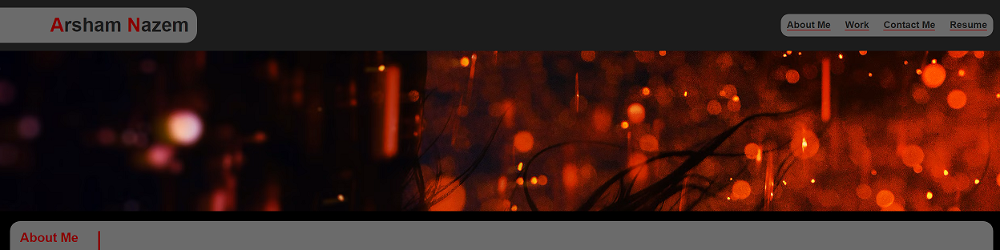

# Deployed Application

Deployed Application is accessible at [this link](https://anaz0004.github.io/simple-developer-portfolio/)!

# Module 02 Challenge: Professional Portfolio

The developer will build a professional portfolio to showcase skills and talents to employers. The most effective portfolio displays highlights and the thoughts processes behind them. A portfolio is essential for employment success.

## User Story

* AS AN employer
* I WANT to view a potential employee's deployed portfolio of work samples
* SO THAT I can review samples of their work and assess whether they're a good candidate for an open position

## Acceptance Criteria

* GIVEN I need to sample a potential employee's previous work
* WHEN I load their portfolio
* THEN I am presented with
    - [x] the developer's name
    - [x] a recent photo or avatar
    - [x] links  to sections about them
    - [x] their work
    - [x] how to contact them
* WHEN I click one of the links in the navigation
* THEN the UI
    - [x] scrolls to the corresponding section
* WHEN I click on the link to the section about their work
* THEN the UI
    - [x] scrolls to a section with titled images of the developer's applications
* WHEN I am presented with the developer's first application
* THEN that application's image
    - [x] should be larger in size than the others
* WHEN I click on the images of the applications
* THEN I am taken to
    - [x] that deployed application
* WHEN I resize the page or view the site on various screens and devices
* THEN I am presented with
    - [x] a responsive layout that adapts to my viewport
